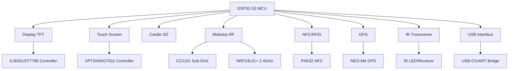
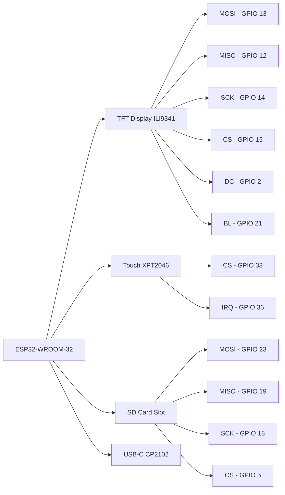
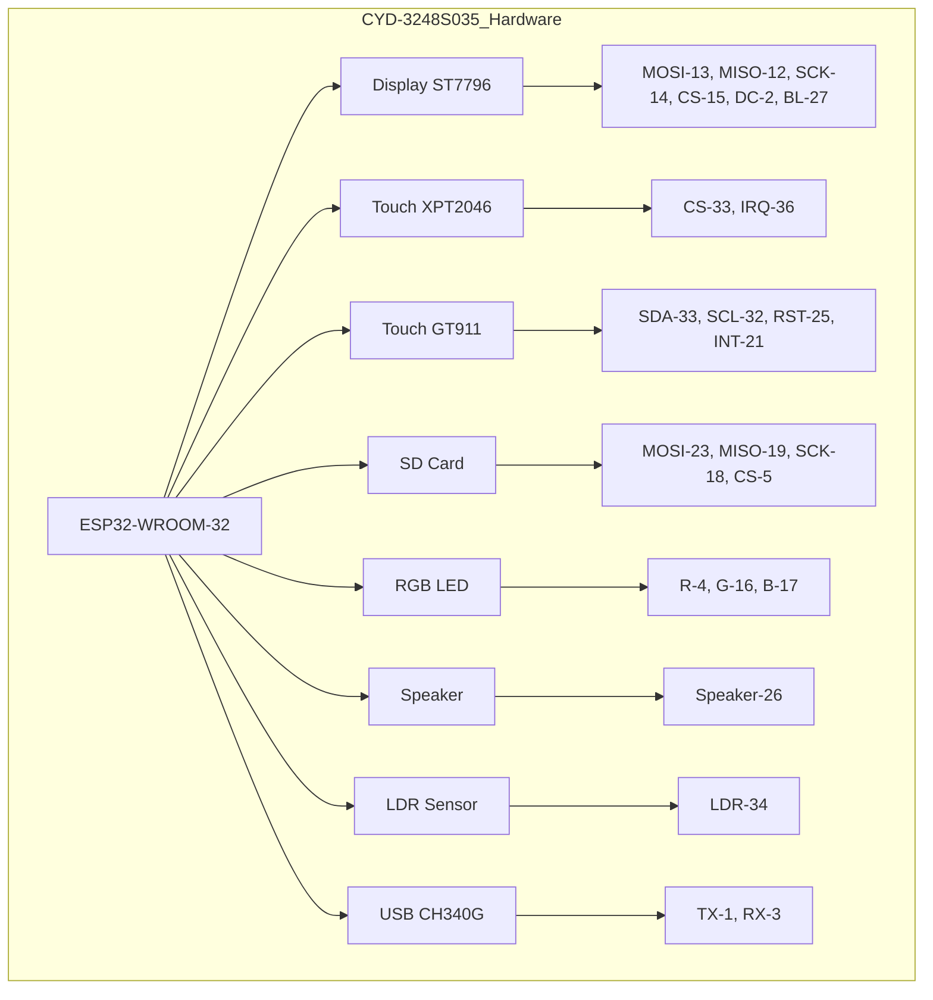

# Willy Firmware - Guia de Configuração de Placas

[](https://platformio.org/)
[](https://www.espressif.com/)
[](https://www.arduino.cc/)
[](https://www.espressif.com/products/socs/esp32-s3)
[](https://en.wikipedia.org/wiki/IEEE_802.11)
[](https://www.bluetooth.com/)
[](https://github.com/Bodmer/TFT_eSPI)
[](https://www.buydisplay.com/)
[](https://www.sdcard.org/)
[](https://github.com/lelebrr/Willy_ESP_s3)

<div align="center">


**🛠️ Kit Definitivo de Segurança para ESP32 - Configuração de Hardware**

[📖 Documentação Principal](../README.md) • [🚀 Início Rápido](#-início-rápido) • [🔧 Hardware Suportado](#-hardware-suportado) • [📋 Placas Disponíveis](#-placas-suportadas)

</div>

## Guia completo para adicionar e configurar novas placas

---

### Índice

- [Visão Geral](#visao-geral)
- [Estrutura de Diretórios](#estrutura-de-diretorios)
- [Adicionando Nova Placa](#adicionando-nova-placa)
- [Arquivos de Configuração](#arquivos-de-configuracao)
- [Placas Suportadas](#placas-suportadas)
- [Solução de Problemas](#solucao-de-problemas)

---

## Visão Geral

Este diretório contém todas as configurações específicas de hardware para as placas suportadas pelo Willy Firmware. Cada placa possui seus próprios arquivos de configuração que definem:

- 📍 **Mapeamento de pinos** (GPIO, SPI, I2C, UART)
- ⚙️ **Configurações de build** (flags, partições)
- 🖥️ **Setup específico** (display, touch, periféricos)
- 📦 **Definições de hardware** (LEDs, botões, cartão SD)
- 🔧 **Integração de módulos** (CC1101, NRF24L01+, PN532, GPS)
- 💾 **Otimização de memória** (partições, PSRAM)
- 🌐 **Configuração de rede** (WiFi, Bluetooth, Ethernet)

### 📊 Arquitetura de Hardware



### 🎯 Especificações Técnicas

| Componente | Especificação | Interface | Voltagem |
|------------|---------------|-----------|----------|
| **MCU** | ESP32-S3 Dual Core 240MHz | - | 3.3V |
| **WiFi** | 802.11 a/b/g/n/ac | - | 3.3V |
| **Bluetooth** | v5.0 BR/EDR + BLE | - | 3.3V |
| **Display** | 320x240 / 480x320 | SPI | 3.3V/5V |
| **Touch** | Resistivo/Capacitivo | I2C/SPI | 3.3V |
| **SD Card** | FAT32/exFAT | SPI | 3.3V |
| **CC1101** | Sub-GHz 300-928MHz | SPI | 3.3V |
| **NRF24L01** | 2.4GHz 2Mbps | SPI | 3.3V |
| **PN532** | NFC 13.56MHz | I2C/SPI | 3.3V |
| **GPS** | NEO-6M UART | UART | 3.3V/5V |
| **IR** | 38-40kHz | GPIO | 3.3V |

---

## Estrutura de Diretórios

```bash
boards/
│
├── 📁 _boards_json/              # JSONs de configuração PlatformIO
│   ├── 📄 CYD-2432S028.json
│   ├── 📄 ESP-General.json
│   ├── 📄 esp32dev.json
│   └── ... outros JSONs
│
├── 📁 pinouts/                   # Pinos genéricos compartilhados
│   ├── 📄 pins_arduino.h         # Header principal de pinos
│   └── 📄 variant.cpp            # Variante do Arduino
│
├── 📁 CYD-2432S028/              # Placa CYD-2432S028
│   ├── 📄 CYD-2432S028.ini       # Configuração PlatformIO
│   ├── 📄 interface.cpp          # Código de inicialização
│   └── 📄 pins_arduino.h         # Mapeamento de pinos
│
├── 📁 ESP-General/               # Configuração genérica ESP32
│   ├── 📄 ESP-General.ini
│   ├── 📄 interface.cpp
│   └── 📄 pins_arduino.h
│
└── 📄 README.md                  # Este arquivo
```bash

---

## Adicionando Nova Placa

### Passo a Passo

#### 1. Criar Diretório da Placa

```bash
mkdir boards/minha_placa
```bash

#### 2. Criar JSON de Configuração

Crie `boards/_boards_json/minha_placa.json`:

```json
{
  "build": {
    "arduino": {
      "ldscript": "esp32.ld"
    },
    "core": "esp32",
    "extra_flags": [
      "-DARDUINO_ESP32_DEV",
      "-DBOARD_HAS_I2C",
      "-DBOARD_HAS_SPI"
    ],
    "f_cpu": "240000000L",
    "f_flash": "80000000L",
    "flash_mode": "qio",
    "mcu": "esp32",
    "variant": "pinouts"
  },
  "connectivity": [
    "wifi",
    "bluetooth",
    "ethereum",
    "can"
  ],
  "debug": {
    "openocd_board": "esp-wroom-32.cfg"
  },
  "frameworks": [
    "arduino",
    "espidf"
  ],
  "name": "Minha Placa ESP32",
  "upload": {
    "flash_size": "4MB",
    "maximum_ram_size": 327680,
    "maximum_size": 4194304,
    "require_upload_port": true,
    "speed": 921600
  },
  "url": "https://minhaplaca.com",
  "vendor": "Meu Fabricante"
}
```cpp

#### 3. Criar Header de Pinos

Crie `boards/minha_placa/pins_arduino.h`:

```cpp
#ifndef Pins_Arduino_h
#define Pins_Arduino_h

#include <stdint.h>

// ================================
// PINOS GPIO
// ================================
#define PIN_WIRE_SDA        21
#define PIN_WIRE_SCL        22

#define PIN_SPI_MISO        19
#define PIN_SPI_MOSI        23
#define PIN_SPI_SCK         18
#define PIN_SPI_SS          5

// ================================
// DISPLAY TFT
// ================================
#define TFT_MISO            19
#define TFT_MOSI            23
#define TFT_SCLK            18
#define TFT_CS              5
#define TFT_DC              2
#define TFT_RST             4
#define TFT_BL              21

// ================================
// TELA TOUCH
// ================================
#define TOUCH_CS            33
#define TOUCH_IRQ           36

// ================================
// CARTÃO SD
// ================================
#define SDCARD_CS           5
#define SDCARD_SCK          18
#define SDCARD_MISO         19
#define SDCARD_MOSI         23

// ================================
// INFRVERMELHO
// ================================
#define IR_TX_PIN           1
#define IR_RX_PIN           3

// ================================
// MÓDULOS RF
// ================================
#define RF_TX_PIN           22
#define RF_RX_PIN           27

// ================================
// LED E BOTÕES
// ================================
#define RGB_LED             -1
#define BTN_PIN             0

// ================================
// SERIAL
// ================================
#define SERIAL_TX           1
#define SERIAL_RX           3
#define GPS_SERIAL_TX       SERIAL_TX
#define GPS_SERIAL_RX       SERIAL_RX

#endif /* Pins_Arduino_h */
```cpp

#### 4. Criar Interface de Inicialização

Crie `boards/minha_placa/interface.cpp`:

```cpp
#include "../core/mykeyboard.h"
#include "../core/display.h"
#include "../core/sd_functions.h"

// Inicialização específica da placa
void initBoard() {
    // Inicializar GPIO
    pinMode(BTN_PIN, INPUT_PULLUP);

    // Inicializar LED RGB se existir
    #ifdef HAS_RGB_LED
    // Código de inicialização do LED
    #endif

    // Outras inicializações específicas
}

// Ler bateria
float readBattery() {
    #ifdef BAT_PIN
    return analogRead(BAT_PIN) * 3.3 / 4095.0;
    #else
    return 0.0;
    #endif
}

// Verificar botão
bool checkBtnPress() {
    return digitalRead(BTN_PIN) == LOW;
}
```cpp

#### 5. Criar Configuração PlatformIO

Crie `boards/minha_placa/minha_placa.ini`:

```ini
[env:minha_placa]
board = minha_placa
monitor_speed = 115200
board_build.partitions = custom_4Mb_full.csv

build_src_filter = ${env.build_src_filter} +<../boards/minha_placa>

build_flags =
    ${env.build_flags}
    -Iboards/minha_placa
    -Os

    # Debug
    -DCORE_DEBUG_LEVEL=0
    -DCONFIG_ESP32_JTAG_SUPPORT_DISABLE=1

    # Identificação da placa
    -DMINHA_PLACA=1
    -DDEVICE_NAME='"Minha Placa"'

    # Recursos
    -DWilly_IR_SERIAL=1
    -DHAS_SCREEN=1
    -DHAS_TOUCH=1

    # Display TFT
    -DUSER_SETUP_LOADED=1
    -DILI9341_2_DRIVER=1
    -DTFT_WIDTH=240
    -DTFT_HEIGHT=320
    -DTFT_BL=21
    -DTFT_BACKLIGHT_ON=HIGH

    # Cartão SD
    -DSDCARD_CS=5
    -DSDCARD_SCK=18
    -DSDCARD_MISO=19
    -DSDCARD_MOSI=23

    # IR
    -DIR_TX_PINS='{{"Pino 1", 1}}'
    -DIR_RX_PINS='{{"Pino 3", 3}}'

    # RF
    -DRF_TX_PINS='{{"Pino 22", 22}}'
    -DRF_RX_PINS='{{"Pino 27", 27}}'

    # CC1101 via SPI
    -DUSE_CC1101_VIA_SPI
    -DCC1101_GDO0_PIN=27
    -DCC1101_SS_PIN=22
    -DCC1101_MOSI_PIN=SPI_MOSI_PIN
    -DCC1101_SCK_PIN=SPI_SCK_PIN
    -DCC1101_MISO_PIN=SPI_MISO_PIN

    # NRF24 via SPI
    -DUSE_NRF24_VIA_SPI
    -DNRF24_CE_PIN=27
    -DNRF24_SS_PIN=22
    -DNRF24_MOSI_PIN=SPI_MOSI_PIN
    -DNRF24_SCK_PIN=SPI_SCK_PIN
    -DNRF24_MISO_PIN=SPI_MISO_PIN

lib_deps = ${env.lib_deps}
```ini

#### 6. Atualizar Header de Pinouts

Adicione em `boards/pinouts/pins_arduino.h`:

```cpp
// Adicionar condição para sua placa
#ifdef MINHA_PLACA
#include "../minha_placa/pins_arduino.h"
#endif
```cpp

#### 7. Atualizar platformio.ini Principal

Adicione em `platformio.ini`:

```ini
[platformio]
default_envs = minha_placa

extra_configs =
    boards/*.ini
    boards/*/*.ini
```bash

---

## Arquivos de Configuração

### JSON de Configuração (`_boards_json/[placa].json`)

| Campo | Descrição |
|-------|-----------|
| `build.mcu` | Tipo de MCU (esp32, esp32s3, esp32c3) |
| `build.f_cpu` | Frequência da CPU em Hz |
| `build.f_flash` | Frequência do flash |
| `build.flash_mode` | Modo flash (qio, dio, qout) |
| `build.variant` | Deve apontar para "pinouts" |
| `upload.flash_size` | Tamanho do flash |
| `upload.maximum_size` | Tamanho máximo do firmware |

**Referência oficial:** [PlatformIO ESP32 Boards](https://github.com/platformio/platform-espressif32/blob/master/boards/)

### Header de Pinos (`[placa]/pins_arduino.h`)

Define todos os pinos GPIO da placa:

| Categoria | Pinos Típicos |
|-----------|---------------|
| **I2C** | SDA, SCL |
| **SPI** | MOSI, MISO, SCK, SS |
| **Display** | TFT_CS, TFT_DC, TFT_RST, TFT_BL |
| **Touch** | TOUCH_CS, TOUCH_IRQ (T_IRQ - interrupção do touch) |
| **Cartão SD** | SDCARD_CS, SDCARD_SCK, etc |
| **IR** | IR_TX, IR_RX |
| **RF** | RF_TX, RF_RX, GDO0 |
| **GPS** | GPS_TX, GPS_RX |
| **LED** | RGB_LED, LED_PIN |
| **Botões** | BTN_PIN |

**Referência oficial:** [Arduino ESP32 Variants](https://github.com/espressif/arduino-esp32/blob/master/variants/)

### Interface (`[placa]/interface.cpp`)

Contém código de inicialização específico:

```cpp
// Funções obrigatórias
void initBoard();        // Inicialização
float readBattery();     // Leitura de bateria
bool checkBtnPress();    // Verificar botão
```cpp

### Configuração PlatformIO (`[placa]/[placa].ini`)

Herda de `[env]` e define configurações específicas:

| Seção | Descrição |
|-------|-----------|
| `build_flags` | Flags de compilação |
| `build_src_filter` | Filtros de código fonte |
| `board_build.partitions` | Tabela de partições |
| `lib_deps` | Dependências específicas |
| `lib_ignore` | Bibliotecas a ignorar |

---

## Placas Suportadas

### 🏆 Placas Recomendadas

<div align="center">

| Placa | Display | Touch | USB | SD Card | Preço | Status |
|-------|---------|-------|-----|---------|-------|--------|
| **CYD-2432S028** | 3.5" ILI9341 | Resistivo | 1x USB-C | ✅ | ~R$100 | ⭐ Recomendado |
| **CYD-2USB** | 3.5" ILI9341 | Resistivo | 2x USB-C | ✅ | ~R$120 | ⭐ Recomendado |
| **CYD-3248S035** | 3.5" ST7796 | Resistivo/Capacitivo | 1x Micro-USB | ✅ | ~R$25 | ✅ Popular |
| **M5Stack Core2 Pro** | 2.0" ILI9341 | Capacitivo | USB-C | ✅ | ~R$180 | ✅ Premium |
| **LilyGo T-Display Pro** | 2.0" ST7789 | Capacitivo | USB-C | ✅ | ~R$60 | ✅ Compacto |

</div>

### 🔧 Especificações Detalhadas

#### CYD-2432S028 (Cheap Yellow Display)

| Especificação | Detalhes |
|---------------|----------|
| **MCU** | ESP32-WROOM-32 (Dual Core 240MHz) |
| **Display** | 3.5" TFT ILI9341, 320x240, 16-bit color |
| **Touch** | Resistivo XPT2046, 4096x4096 resolution |
| **Cartão SD** | Slot embutido, SPI interface, FAT32 |
| **USB** | 1x USB-C, CP2102 UART bridge |
| **Memória** | 4MB Flash, 320KB RAM |
| **Preço** | ~R$100 |
| **Fabricante** | Various Chinese suppliers |
| **Disponibilidade** | High, AliExpress, eBay |

#### Pinagem CYD-2432S028



#### Pinagem CYD

```bash

TFT:
  MOSI → GPIO 13
  MISO → GPIO 12
  SCK  → GPIO 14
  CS   → GPIO 15
  DC   → GPIO 2
  BL   → GPIO 21

Touch:
  MOSI → GPIO 13
  MISO → GPIO 12
  SCK  → GPIO 14
  CS   → GPIO 33
  IRQ  → GPIO 36

Cartão SD:
  MOSI → GPIO 23
  MISO → GPIO 19
  SCK  → GPIO 18
  CS   → GPIO 5

```bash

### CYD-2USB

Versão aprimorada do CYD-2432S028 com dupla interface USB:

| Característica | Detalhes |
|----------------|----------|
| **USB** | 2x USB-C (Data + Power) |
| **Display** | ILI9341 com inversão de cor |
| **Touch** | Resistivo XPT2046 |
| **SD Card** | Slot embutido |
| **Vantagem** | Dual boot capability, debugging simultâneo |
| **Preço** | ~R$120 |
| **Ideal para** | Desenvolvimento e depuração avançada |

#### Pinagem CYD-2USB

```bash
# Interface 1 (Data)
USB1_TX → GPIO 1
USB1_RX → GPIO 3

# Interface 2 (Power + Data)
USB2_TX → GPIO 41
USB2_RX → GPIO 42

# Display (compartilhado)
TFT_MOSI → GPIO 13
TFT_MISO → GPIO 12
TFT_SCK  → GPIO 14
TFT_CS   → GPIO 15
TFT_DC   → GPIO 2
TFT_RST  → GPIO 4
TFT_BL   → GPIO 21

# Touch
TOUCH_CS → GPIO 33
TOUCH_IRQ → GPIO 36

# SD Card
SD_MOSI → GPIO 23
SD_MISO → GPIO 19
SD_SCK  → GPIO 18
SD_CS   → GPIO 5
```

### CYD-3248S035 (Cheap Yellow Display 3.5")

Placa premium com recursos avançados:

| Especificação | Detalhes |
|---------------|----------|
| **MCU** | ESP32-WROOM-32 (Dual Core 240MHz) |
| **Display** | 3.5" TFT ST7796, 480x320, 18-bit color |
| **Touch Resistivo** | XPT2046, 4096x4096 resolution |
| **Touch Capacitivo** | GT911, 1024x600 resolution |
| **Cartão SD** | Slot embutido, SPI interface |
| **USB** | 1x Micro-USB, CH340G UART |
| **Extras** | RGB LED (RGB), Speaker (GPIO 26), LDR (GPIO 34) |
| **Preço** | ~R$25 |
| **Fabricante** | Various Chinese suppliers |
| **Disponibilidade** | High, AliExpress, eBay |

#### Pinagem CYD-3248S035



#### Recursos Especiais CYD-3248S035

- 🎨 **Dual Touch**: Resistivo + Capacitivo
- 🔊 **Speaker Integrado**: Para alertas e áudio
- 💡 **RGB LED**: Indicação de status colorida
- 📊 **LDR Sensor**: Leitura de ambiente luminoso
- 🔌 **Expansão**: Conectores P1, P3, CN1 para expansão
- 🔋 **Bateria**: Suporte para bateria externa 1.25mm

#### Pinagem CYD-3248S035

```bash

TFT (ST7796):
  MOSI → GPIO 13
  MISO → GPIO 12
  SCK  → GPIO 14
  CS   → GPIO 15
  DC   → GPIO 2
  BL   → GPIO 27

Touch Resistivo (XPT2046):
  CS   → GPIO 33
  IRQ  → GPIO 36
  (CLK/DIN/DOUT compartilhados com TFT)

Touch Capacitivo (GT911):
  SDA  → GPIO 33
  SCL  → GPIO 32
  RST  → GPIO 25
  INT  → GPIO 21

Cartão SD:
  MOSI → GPIO 23
  MISO → GPIO 19
  SCK  → GPIO 18
  CS   → GPIO 5

Periféricos & Expansão:
  Speaker     → GPIO 26 (P4 Conector)
  LED R       → GPIO 4  (ativo LOW)
  LED G       → GPIO 16 (ativo LOW)
  LED B       → GPIO 17 (ativo LOW)
  LDR (Luz)   → GPIO 34 (ADC, input-only)
  Bateria     → Conector 4P (1.25mm) Direct Power (Sem Mod de ADC nativo)
  P1 (UART)   → TX (1), RX (3)
  P3 (IO)     → GPIO 35, 22, 21
  CN1 (I2C)   → SCL (22), SDA (27)

```bash

📖 **Documentação completa:** [hardware_cyd_3248s035.md](../docs/hardware_cyd_3248s035.md)

### ESP-General

Configuração genérica para qualquer ESP32:

- Use como modelo para novas placas
- Funciona com ESP32, ESP32-S3, ESP32-C3
- Pinagem configurável via defines

---

## Solução de Problemas

### Problemas Comuns

| Problema | Solução |
|----------|---------|
| **Placa não compila** | Verifique os defines e includes |
| **Tela branca** | Verifique pinos do display |
| **Touch não funciona** | Verifique pinos do touch |
| **SD não monta** | Verifique pinos do cartão SD |
| **IR não envia** | Verifique pino IR_TX |

### Debug

```bash
# Compilar com debug
pio run -e minha_placa -v

# Ver erros
pio run -e minha_placa 2>&1 | grep error
```bash

### Validação

```bash
# Verificar configuração
pio boards | grep minha_placa

# Listar ambientes
pio run --list-targets
```bash

---

## Referências

### Documentação Oficial

| Recurso | Link |
|---------|------|
| PlatformIO ESP32 | [docs.platformio.org](https://docs.platformio.org/pt/latest/platforms/espressif32.html) |
| Arduino ESP32 | [espressif.com](https://docs.espressif.com/projects/arduino-esp32/) |
| Datasheet ESP32 | [espressif.com](https://www.espressif.com/sites/default/files/documentation/esp32_datasheet_en.pdf) |
| TFT_eSPI | [github.com/Bodmer/TFT_eSPI](https://github.com/Bodmer/TFT_eSPI) |

### Modelos

| Modelo | Uso |
|--------|-----|
| `ESP-General` | Ponto de partida para novas placas |
| `CYD-2432S028` | Referência completa com display |

---


### Willy Firmware

**[⬆ Voltar ao Topo](#willy-firmware-guia-de-configuracao-de-placas)**

*Documentação mantida pela comunidade Willy*

