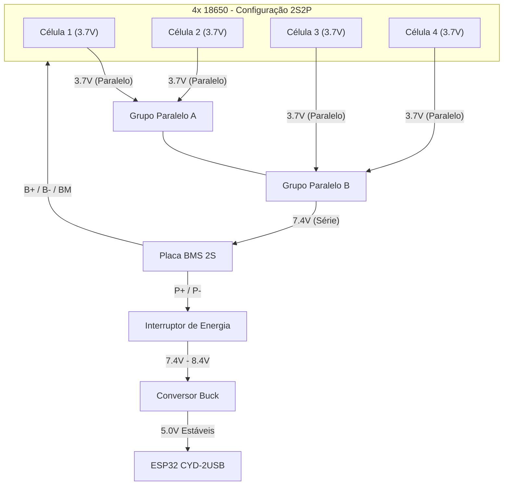

# Guia de Configuração de Hardware Willy 2.1 - Bateria e Energia

Este guia explica como alimentar corretamente seu dispositivo Willy usando um banco de baterias 18650 de alta capacidade.

## Componentes Necessários

1. **4x Baterias 18650** (preferencialmente células de alta qualidade como LG HG2 ou Samsung 25R).
2. **BMS 2S (Battery Management System)**: Classificado para pelo menos 5-10A.
3. **Conversor Buck (Step-Down)**: Para converter os 8.4V (carga total) em 5V estáveis para o ESP32.
4. **Interruptor DC**: Para controle físico de energia.

## Esquema de Fiação

## Notas Importantes de Segurança
>
> [!WARNING]
> **Configuração 2S (7.4V)**: Você DEVE usar um BMS 2S. Um BMS 1S não funcionará e pode ser perigoso para esta voltagem.
> **Conversor Buck**: NÃO conecte os 8.4V diretamente ao pino 5V do ESP32. Você queimará a placa. Sempre use um conversor buck.

## Configuração no Firmware

A função `getBattery()` em `utils.cpp` está calibrada para um divisor de tensão.
Certifique-se de que seu divisor de tensão esteja conectado à saída do BMS (antes do conversor buck) e escalonado apropriadamente para o ESP32 (0-3.3V).

### Divisor de Tensão Típico para 2S (8.4V máx)

- R1: 10k
- R2: 4.7k
- Proporção: 0.32
- 8.4V * 0.32 = 2.68V (Seguro para o ADC do ESP32)
