# Pinout Mestre: Willy ESP32-S3-WROOM-1-N8R2

> [!NOTE]
> Este guia cobre a implementação completa do projeto Willy usando um ESP32-S3-WROOM-1-N8R2 com **13 módulos externos** mapeados sem conflitos de SPI/I2C/UART.
> Para detalhes completos de fiação, veja a [Bíblia do Hardware](willy_hardware_bible.md).

## Mapa Visual de Pinos

```mermaid
%%{init: {'theme': 'dark'}}%%
graph TD
    subgraph ESP32[ESP32-S3 WROOM-1 N8R2]
        P_VDD[3.3V / 5V]
        P_GND[GND]

        %% SPI Bus
        P11[GPIO 11 - MOSI]
        P12[GPIO 12 - SCK]
        P13[GPIO 13 - MISO]

        %% I2C Bus
        P8[GPIO 8 - SDA]
        P17[GPIO 17 - SCL]

        %% UART
        P39[GPIO 39 - RX]
        P40[GPIO 40 - TX]

        %% I2S Audio
        P2[GPIO 2 - I2S SD/DIN]
        P41[GPIO 41 - I2S SCK/BCLK]
        P42[GPIO 42 - I2S WS/LRCK]

        %% Analog Joystick
        P4[GPIO 4 - ADC JOY_X]
        P5[GPIO 5 - ADC JOY_Y]
        P6[GPIO 6 - JOY BTN]

        %% CS & Extra Pins
        P10[GPIO 10 - TFT CS]
        P9[GPIO 9 - TFT DC]
        P14[GPIO 14 - TFT RST]
        P15[GPIO 15 - TOUCH CS]

        P38[GPIO 38 - SD CS]

        P16[GPIO 16 - NRF1 CSN]
        P21[GPIO 21 - NRF1 CE]
        P35[GPIO 35 - NRF2 CSN]
        P36[GPIO 36 - NRF2 CE]

        P18[GPIO 18 - CC1101 CS]
        P33[GPIO 33 - CC1101 GDO0]
        P34[GPIO 34 - CC1101 GDO2]

        %% IR
        P1[GPIO 1 - IR TX]
        P47[GPIO 47 - IR RX]

        %% Internal
        P48[GPIO 48 - WS2812 RGB built-in]
    end

    %% Modules
    TFT["2.4in TFT ILI9341"]
    TOUCH[TFT Touch XPT2046]
    SD[Micro SD Card]
    NRF1["NRF24L01+PA #1"]
    NRF2["NRF24L01+PA #2"]
    CC[CC1101 433MHz]
    NFC[PN532 NFC/RFID]
    RTC[RTC DS3231]
    GES[PAJ7620 Gesture]
    GPS[GPS NEO-6M]
    MIC[INMP441 Mic]
    JOY[Joystick KY-023]
    IR[IR Serial YS-IRTM]

    %% Connections
    P11 & P12 & P13 --> TFT & TOUCH & SD & NRF1 & NRF2 & CC
    P8 & P17 --> NFC & RTC & GES
    P39 -->|TX| GPS
    P40 -->|RX| GPS
    P2 & P41 & P42 --> MIC
    P4 & P5 & P6 --> JOY
    P1 & P47 --> IR

    P10 & P9 & P14 --> TFT
    P15 --> TOUCH
    P38 --> SD
    P16 & P21 --> NRF1
    P35 & P36 --> NRF2
    P18 & P33 & P34 --> CC
```

---

## Atribuições Detalhadas de Pinos

### 1. Barramento SPI (Compartilhado por 6 Módulos)

| Pino ESP32-S3 | Sinal | Módulos Conectados |
| :--- | :--- | :--- |
| `12` | **SCK / CLK** | TFT, Touch, SD Card, NRF24L01 #1, NRF24L01 #2, CC1101 |
| `11` | **MOSI** | TFT, Touch, SD Card, NRF24L01 #1, NRF24L01 #2, CC1101 |
| `13` | **MISO** | TFT, Touch, SD Card, NRF24L01 #1, NRF24L01 #2, CC1101 |

### 2. Chip Selects e Pinos Específicos de Módulos SPI

| Pino ESP32-S3 | Função | Módulo Alvo |
| :--- | :--- | :--- |
| `10` | **TFT_CS** | Display TFT ILI9341 |
| `9` | **TFT_DC** (Data/Command) | Display TFT ILI9341 |
| `14` | **TFT_RST** (Reset) | Display TFT ILI9341 |
| `15` | **TOUCH_CS** | Touch XPT2046 |
| `36` | **TOUCH_IRQ** | **Interrupção do Touch** (T_IRQ) |
| `38` | **SDCARD_CS** | Cartão Micro SD |
| `16` | **NRF1_CSN** | NRF24L01+PA+LNA #1 |
| `21` | **NRF1_CE** | NRF24L01+PA+LNA #1 |
| `35` | **NRF2_CSN** | NRF24L01+PA+LNA #2 |
| `36` | **NRF2_CE** | NRF24L01+PA+LNA #2 |
| `18` | **CC1101_CS** | CC1101 Sub-GHz |
| `33` | **GDO0** (Interrupção) | CC1101 Sub-GHz |
| `34` | **GDO2** (Status) | CC1101 Sub-GHz |

### 3. Barramento I2C (Compartilhado por 3 Módulos)

| Pino ESP32-S3 | Sinal | Módulos Conectados (Endereço) |
| :--- | :--- | :--- |
| `8` | **SDA** | PN532 NFC (`0x24`), DS3231 RTC (`0x68`), PAJ7620 Gesture (`0x73`) |
| `17` | **SCL** | PN532 NFC (`0x24`), DS3231 RTC (`0x68`), PAJ7620 Gesture (`0x73`) |

### 4. UART / Serial

| Pino ESP32-S3 | Papel ESP | Módulo | Barramento |
| :--- | :--- | :--- | :--- |
| `40` | **TX** | GPS NEO-6M (→RX) | UART1 |
| `39` | **RX** | GPS NEO-6M (←TX) | UART1 |
| `1` | **TX** | YS-IRTM IR (→RXD) | UART2 |
| `47` | **RX** | YS-IRTM IR (←TXD) | UART2 |

### 5. I2S Áudio Digital

| Pino ESP32-S3 | Sinal | Módulo |
| :--- | :--- | :--- |
| `41` | **SCK / BCLK** | INMP441 Microfone |
| `42` | **WS / LRCK** | INMP441 Microfone |
| `2` | **SD / DIN** | INMP441 Microfone |

### 6. Analógico / GPIO (Joystick & LED)

| Pino ESP32-S3 | Sinal | Função |
| :--- | :--- | :--- |
| `4` | **ADC CH** | Joystick Eixo X |
| `5` | **ADC CH** | Joystick Eixo Y |
| `6` | **Digital** | Botão do Joystick (INPUT_PULLUP) |
| `48` | **Internal LED** | WS2812 RGB Built-in (NeoPixel) |

---

## Notas Sobre a Montagem

1. **Energia dos Rádios**: Os NRF24L01+ PA+LNA e CC1101 devem ser alimentados por um **LDO dedicado** (AMS1117-3.3V), não pela saída 3.3V do ESP32. Eles consomem picos de corrente que derrubam o regulador interno.

2. **Capacitores nos NRF24**: Solde capacitores de **10μF + 100nF** entre VCC e GND de cada módulo NRF, o mais perto possível dos pinos.

3. **Antenas SMA**: **Nunca** energize um módulo NRF PA+LNA ou CC1101 sem a antena conectada.

4. **Problema do MISO do SD**: Módulos Micro SD baratos podem não liberar o MISO (não entram em Hi-Z). Use módulos com chip buffer 74LVC125A ou adicione resistor em série.

5. **Pull-ups I2C**: Com 3 módulos I2C, os pull-ups podem ser excessivos. Se houver problemas, remova os pull-ups extras dos módulos.

6. **PN532 DIP Switches**: Devem ser configurados para I2C (Chave 1 = ON, Chave 2 = OFF) **antes** de energizar.

---

## 📖 Documentação Relacionada

- [Bíblia do Hardware (Guia Completo)](willy_hardware_bible.md) — Fiação detalhada de todos os 13 módulos
- [Display TFT ILI9341](module_tft_ili9341_touch.md)
- [NRF24L01+ PA+LNA (Dual)](module_nrf24l01.md)
- [CC1101 Sub-GHz](module_cc1101.md)
- [PN532 NFC/RFID](nfc_pn532.md)
- [DS3231 RTC + PAJ7620 Gesture](module_i2c_gesture_rtc.md)
- [GPS NEO-6M](module_gps_neo.md)
- [YS-IRTM IR Serial](ys_irtm_ir_serial.md)
- [INMP441 Microfone](module_inmp441_mic.md)
- [Joystick KY-023](module_joystick_ir.md)
- [Micro SD Card](module_micro_sd.md)
- [Acessórios (BMS & Sniffer)](module_accessories.md)
